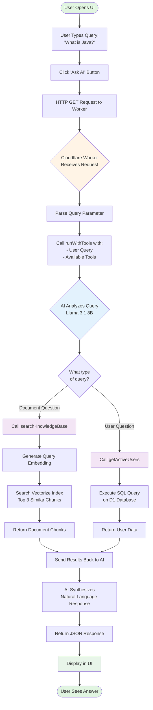
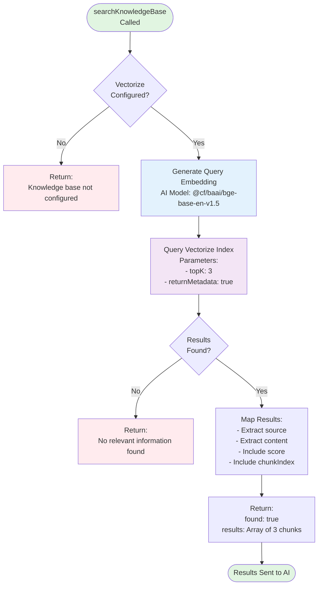
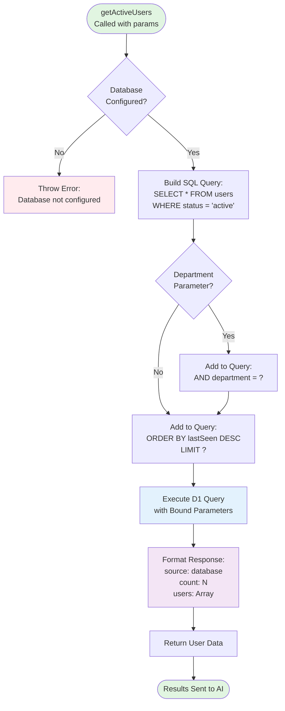
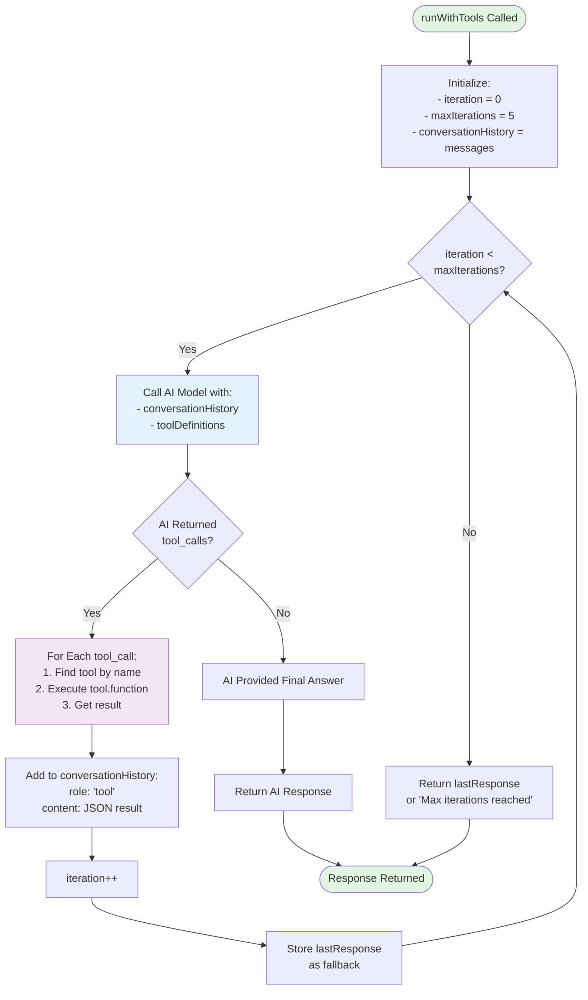
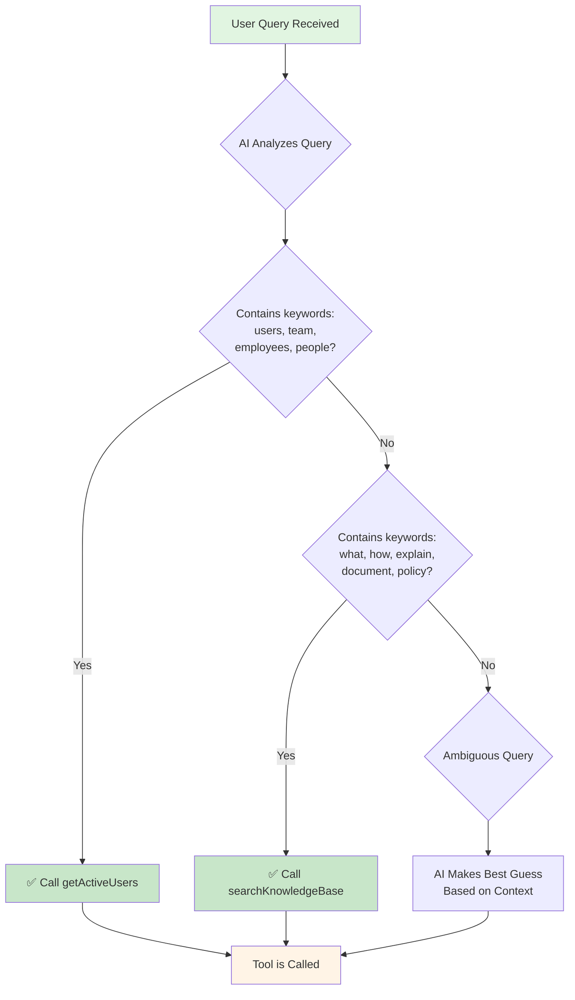
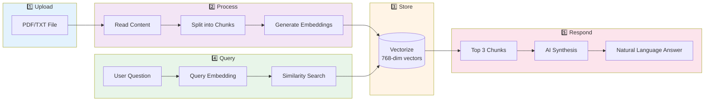
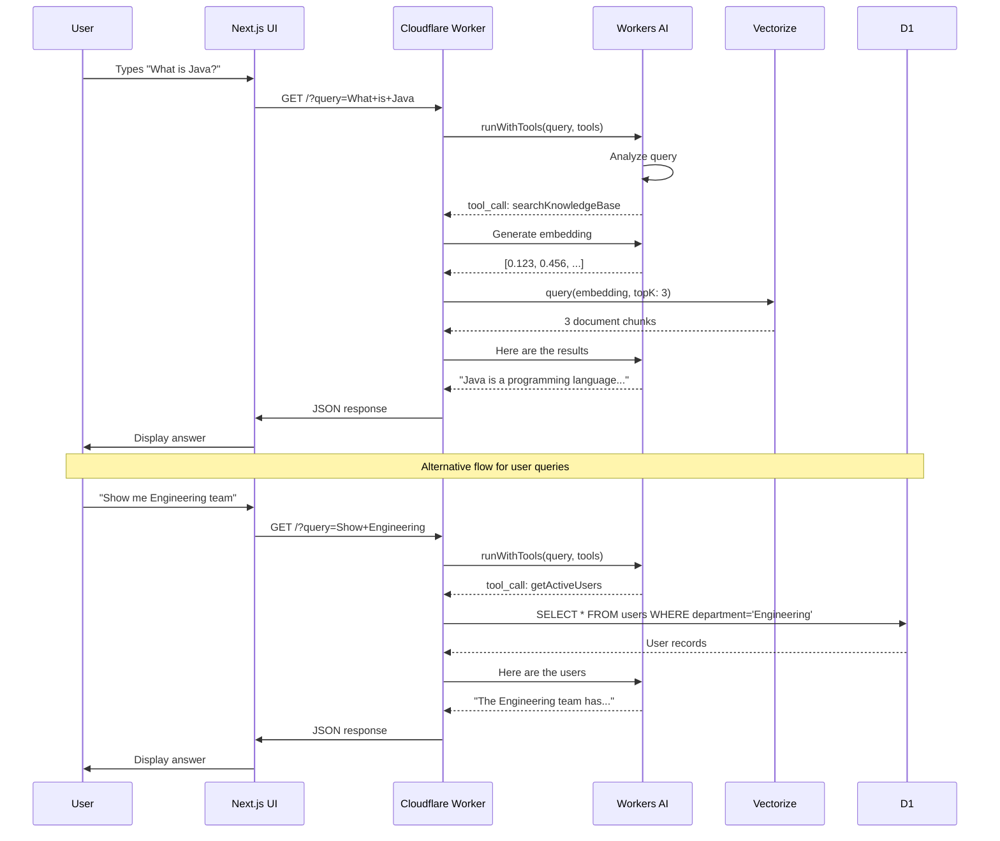
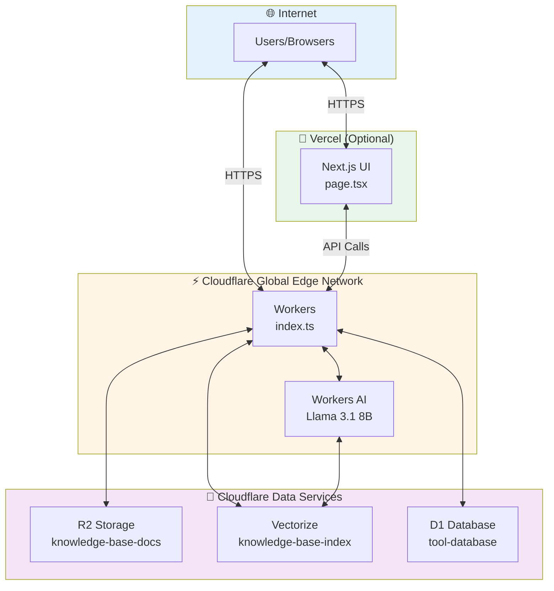

# Project Flowchart - Visual Flow Diagrams

## 🔄 Main Application Flow



## 📊 Document Processing Flow

```mermaid
flowchart TD
    Upload([User Uploads Document<br/>to R2 via Dashboard]) --> Trigger[User Triggers:<br/>curl /process-docs]

    Trigger --> List[List All Objects<br/>in R2 Bucket]
    List --> Loop{For Each<br/>Document}

    Loop --> Read[Read Document Content<br/>from R2]
    Read --> Split[Split into 500-char Chunks]
    Split --> ChunkLoop{For Each<br/>Chunk}

    ChunkLoop --> GenEmbed[Generate Embedding<br/>using AI Model<br/>@cf/baai/bge-base-en-v1.5]
    GenEmbed --> Truncate[Truncate Text to 1000 chars<br/>to fit Vectorize limit]
    Truncate --> Store[Store in Vectorize:<br/>- ID: filename-chunk-N<br/>- Values: [768 dimensions]<br/>- Metadata: source, text, index]

    Store --> NextChunk{More Chunks?}
    NextChunk -->|Yes| ChunkLoop
    NextChunk -->|No| NextDoc{More Docs?}

    NextDoc -->|Yes| Loop
    NextDoc -->|No| Stats[Return Processing Stats]
    Stats --> Done([Documents Ready<br/>for Search])

    style Upload fill:#e1f5e1
    style Done fill:#e1f5e1
    style GenEmbed fill:#e3f2fd
    style Store fill:#f3e5f5
```

## 🔍 Search Knowledge Base Flow



## 👥 Get Active Users Flow



## 🔁 Tool Calling Loop (runWithTools)



## 🌐 Complete End-to-End Flow

```mermaid
flowchart TB
    subgraph Client["🖥️ Client Side (Next.js)"]
        UI[User Interface]
        Input[Query Input Field]
        Button[Ask AI Button]
        Display[Response Display]
    end

    subgraph Edge["⚡ Cloudflare Edge"]
        Worker[Worker Entry Point]
        Router{Route Handler}
        ProcessDocs[/process-docs endpoint]
        QueryHandler[Query Handler]
    end

    subgraph AI["🤖 AI Layer"]
        Llama[Llama 3.1 8B Model]
        ToolCalling[Tool Calling Logic]
        Embedding[Embedding Model<br/>bge-base-en-v1.5]
    end

    subgraph Tools["🔧 Tools"]
        SearchKB[searchKnowledgeBase]
        GetUsers[getActiveUsers]
    end

    subgraph Storage["💾 Storage Layer"]
        R2[(R2 Bucket<br/>Documents)]
        Vectorize[(Vectorize Index<br/>Embeddings)]
        D1[(D1 Database<br/>Users)]
    end

    UI --> Input
    Input --> Button
    Button -->|HTTP GET/POST| Worker

    Worker --> Router
    Router -->|/process-docs| ProcessDocs
    Router -->|query param| QueryHandler

    ProcessDocs --> R2
    ProcessDocs --> Embedding
    Embedding --> Vectorize

    QueryHandler --> Llama
    Llama --> ToolCalling

    ToolCalling --> SearchKB
    ToolCalling --> GetUsers

    SearchKB --> Embedding
    Embedding --> Vectorize
    Vectorize --> SearchKB

    GetUsers --> D1
    D1 --> GetUsers

    SearchKB --> Llama
    GetUsers --> Llama

    Llama -->|Final Response| Worker
    Worker -->|JSON| Display

    style Client fill:#e3f2fd
    style Edge fill:#fff4e6
    style AI fill:#f3e5f5
    style Tools fill:#e8f5e9
    style Storage fill:#fce4ec
```

## 🎯 Decision Tree: Which Tool Gets Called?



## 📈 Data Flow: Document to Answer



## 🔄 Request/Response Cycle



## 📍 System Architecture Diagram



---

## 📝 How to View These Flowcharts

These flowcharts use **Mermaid** syntax. To view them:

1. **GitHub**: Upload this file - GitHub automatically renders Mermaid
2. **VS Code**: Install "Markdown Preview Mermaid Support" extension
3. **Online**: Copy to https://mermaid.live/
4. **Documentation Sites**: Supports Mermaid natively (GitBook, Docusaurus, etc.)

## 🎨 Legend

- 🟢 **Green nodes**: Start/End points
- 🟡 **Yellow nodes**: Processing/Logic
- 🔵 **Blue nodes**: AI operations
- 🟣 **Purple nodes**: Tool execution
- 🔴 **Red nodes**: Errors
- 💾 **Database symbols**: Data storage